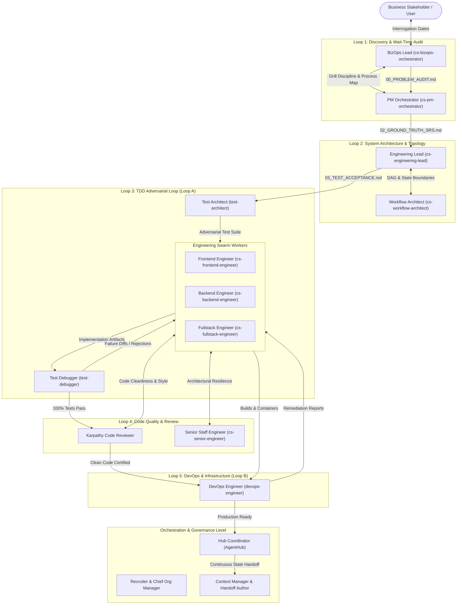

# Strategist Multi-Agent Organizational Topology & Looping Mesh

> **Architect**: Recruiter & Chief Organizational Manager  
> **Source Canon**: [alirezarezvani/claude-skills](https://github.com/alirezarezvani/claude-skills)  
> **Ingestion Policy**: Zero Synthetic Generation — 100% Real Imported Agents  

---

## 1. Executive Organization & Looping Topology

---

## 2. Recruited Roster & Operational Contracts

| Agent ID | Real Title | Domain | Loop Assignment | Looping Peers |
| :--- | :--- | :--- | :--- | :--- |
| `cs-bizops-orchestrator` | **Business Operations & Process Lead** | `business-operations` | Loop 1 (Problem Discovery & Wait-Time Audit) | cs-pm-orchestrator |
| `cs-pm-orchestrator` | **Delivery & Project Management Orchestrator** | `project-management` | Loop 1 (Problem Discovery & Wait-Time Audit) | cs-bizops-orchestrator |
| `cs-engineering-lead` | **Engineering Lead & Technical System Architect** | `engineering` | Loop 2 (Architecture & System Design) | cs-senior-engineer, cs-workflow-architect |
| `cs-workflow-architect` | **Workflow, DAG & State Machine Architect** | `engineering` | Loop 2 (Architecture & System Design) | cs-engineering-lead |
| `cs-frontend-engineer` | **Frontend Engineering Orchestrator (UI/UX, Mobile, Tablet)** | `engineering` | Loop 3 (TDD Implementation Loop) & Loop 4 (Code Quality) | cs-backend-engineer, test-architect, karpathy-reviewer |
| `cs-backend-engineer` | **Backend Engineering Orchestrator (API, Persistence, Microservices)** | `engineering` | Loop 3 (TDD Implementation Loop) & Loop 4 (Code Quality) | cs-frontend-engineer, test-architect, karpathy-reviewer |
| `cs-fullstack-engineer` | **Fullstack Rapid Prototyper** | `engineering` | Loop 3 (TDD Implementation Loop) | cs-senior-engineer |
| `cs-senior-engineer` | **Senior Staff Engineer (Patterns & Resilience)** | `engineering` | Loop 4 (Code Quality & Review) | karpathy-reviewer, cs-engineering-lead |
| `test-architect` | **Test Architect & Adversarial Strategy Lead** | `testing` | Loop 3 (TDD Implementation Loop) | cs-frontend-engineer, cs-backend-engineer |
| `test-debugger` | **Runtime Test Debugger & Assertion Verifier** | `testing` | Loop 3 (TDD Implementation Loop) | test-architect |
| `karpathy-reviewer` | **Adversarial Code Reviewer & Cleanliness Auditor** | `engineering` | Loop 4 (Code Quality & Review) | cs-senior-engineer |
| `devops-engineer` | **DevOps & Infrastructure Engineer** | `devops` | Loop 5 (Runtime, Security & Infrastructure) | cs-backend-engineer, hub-coordinator |
| `hub-coordinator` | **AgentHub Multi-Agent Swarm Coordinator** | `orchestration` | Orchestration & Convergence Governor | Recruiter / Chief Org Manager |
| `cs-handoff-author` | **Context Compaction & Shift Handoff Author** | `productivity` | Continuity & Handoff Loop | Context Manager |

---

## 3. Cyclic Looping & Convergence Protocols

1. **Depth-First Loop Closure**: No phase promotes linearly. Every milestone requires confirmation by an adversarial checker.
2. **Deterministic Precedence**: Test assertions outrank model opinions. Automated unit/integration tests must pass 100%.
3. **5-Iteration Circuit Breaker**: If any worker ⇄ checker loop exceeds 5 bounces without convergence, execution pauses and the Chief Org Manager escalates to the user with the consolidated audit log.
4. **Token Compaction Handoffs**: At 100k active tokens, the `cs-handoff-author` and `Context Manager` distill conversation state into immutable decisions before cycling agent threads.
