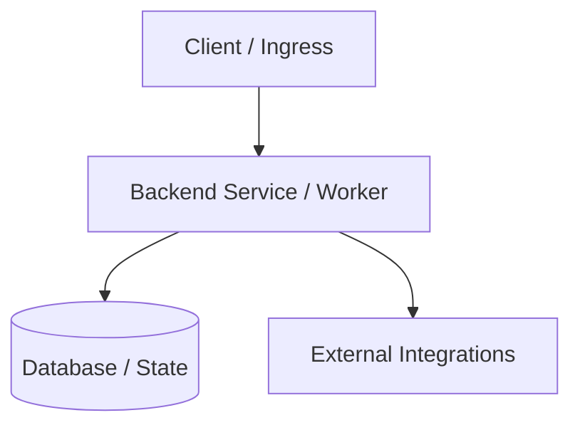

# 01: Ecosystem Topology & System Boundaries

> **Author**: Business Discovery & Requirements Analyst  
> **Status**: Pending Phase 3 Gate  
> **Project**: Strategist  

---

## 1. Solution Archetype Classification
*Guard Against Solution Bias: Choose the minimal viable architecture.*

- [ ] **Workflow Automation / Webhook / Script** (Zero user-facing UI, headless cron/event-driven)
- [ ] **CLI / Headless Service** (Developer/operator command line tool or daemon)
- [ ] **Single Application** (Unified frontend + backend for a single persona)
- [ ] **Decoupled Multi-App Constellation** (e.g., Public Portal + Internal Admin + Worker Services)

---

## 2. Actors & Workflow Boundaries
| Actor | Role | Interactions / Ingress | Egress / Outcome |
| :--- | :--- | :--- | :--- |
| *e.g., End User* | *Customer* | *Web Portal / Mobile* | *Submit order* |
| *e.g., Operator* | *Admin / Support* | *Dashboard / CLI* | *Verify & fulfill* |

---

## 3. High-Level Component Diagram

---

## 4. Integration & Security Perimeter
- **Data Ingress**: *[REST, GraphQL, Webhooks, Message Queue]*
- **Data Persistence**: *[PostgreSQL, SQLite, Redis, Object Storage]*
- **External Dependencies**: *[Third-party APIs, OAuth, Payment gateways]*
- **Compliance & Constraints**: *[GDPR, SOC2, HIPAA, Token budget, Rate limits]*
